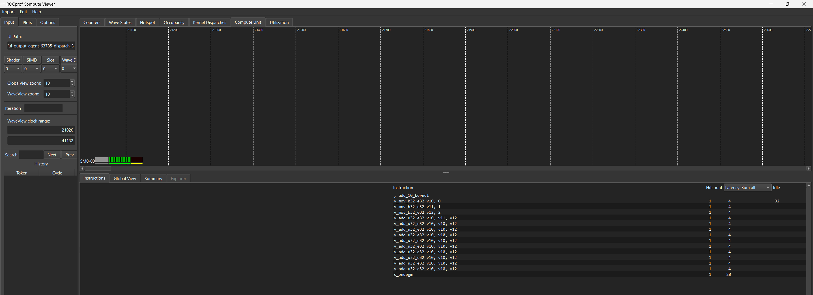
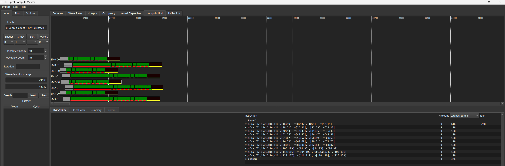

# Minimal ASM Example

This demo contains a minimal MLIR kernel ([`add_10.mlir`](add_10.mlir)) with 10
sequential VOP2 `v_add_u32` instructions.
The [`run.py`](run.py) script compiles the MLIR to AMDGCN assembly and executes
it on a gfx942 GPU. Run it as:

```
python demo/run.py
```

For documentation purposes, we save the produced assembly ([`add_10.s`](add_10.s)).

Note that the kernel is already scheduled and register-allocated manually, the
MLIR pass pipeline in [`run.py`](run.py) is thus empty and "What You See Is
What You Get" (WYSIWYG).

The [`run-rocprof.sh`](run-rocprof.sh) script profiles the kernel using
`rocprofv3` to measure instruction-level metrics.
The script captures only the 3rd iteration out of 5 to avoid compulsory icache
effects in the trace. Run it as:

```
sh demo/run-rocprof.sh demo/add_10.mlir
```

Viewing the trace with rocprof-compute-viewer should resemble:


Note: In an ideal case we would want to launch as few instructions as possible to
precisely measure the hardware feature we care about (i.e. 1 single wave here).
This requires precise targeting of the CU/SIMD that will receive the kernel.
rocprofv3 provides such control but we were only successful using it on RDNA so
far. So for now we limit ourselves with launching #NUM_CU workgroups with 1 wave
per workgroup.

# Going Further: Generating the IR

It is straightforward to implement such a simple kernel in low-level MLIR directly
and more generally kernels of a few dozen lines of IR. This method provides a
simple, type-safe "WYSIWYG" path for exploring hardware features on whatever asm
one wishes. Still, for larger cases, things can quickly become unwieldy and one
has to resort to generation of the low-level IR.

ASTER 💫 provides 3 main paths to achieve this:

1. Metaprogram it directly using the python APIs.
2. Resort to higher-level abstractions and apply MLIR passes and lowerings.
3. A careful mix of 1. and 2.

At this time, paths 2. and 3. often quickly break WYSIWYG properties: dead-code
elimination (DCE) kicks in by default when performing MLIR dataflow analyses or
even calling the upstream MLIR greedy pattern rewriter.

As a consequence, if we wish to only look at a sequence of compute operations
without side effects, the current recommended way is via python metaprogramming.

[`generate_add_10.py`](generate_add_10.py) provides such an example and shows
how one can benefit from python sugar such as variable declarations, list
comprehensions and loops to generate unrolled code. Run it as:

```
python demo/generate_add_10.py > demo/add_10.mlir
```

## Going Further: Exhibit Instruction Issue Limits

We push this a little further with a simple experiment: let's see how much we
can pump **independent** MATRIX instructions through the pipeline, in the absence
of any other asm dependencies (no VALU, no GLOBAL or LDS).

As a reminder, this is all dead code from the point of view of a compiler and the
mere ability to generate such asm is one of our value propositions.

We know on mi300x there are 304 CUs (default) and 4 SIMD units.
We force the execution of 8 waves, each with 10 mfmas, per CU, hoping to
achieve some interesting visualization.

```
python demo/generate_mfma_10.py > /tmp/mfma_10.mlir && \
sh demo/run-rocprof.sh /tmp/mfma_10.mlir --num-waves-per-cu 8
```

The results are compelling: we see the serialization effects of multiple waves
hitting the same MATRIX unit clearly in the following picture:


The main observations are:

1. Althrough there is a delay in the beginning until all waves are scheduled on
the hardware, it is minimal: we are still able to overlap as little as 10 MFMA
instructions and observe interference effects.
1. Within a single wave, the first MFMA is scheduled and starts executing in as
little as 4 cycles. Subsequent ones compete for the MATRIX unit and have to wait
for 16 cycles: there does not seem to be an issue queue to allow buffering
multiple instructions. This could be an opportunity to schedule other operations
on other units (if hardware allows it at such fine granularity).
1. Across 2 waves, the second co-located wave is clearly delayed until the first
wave completes.

With such simple yet powerful examples, it is possible to quickly gain deep
insights into how the hardware behaves.

# Going Beyond: MLIR-Based IR Generation

These simple python examples provide a powerful layer of control and productivity
over the underlying low-level MLIR representation. MLIR itself provides a
compelling type-safe layer over asm, function composition, clean error reporting,
location tracking, fast multi-threaded compilation etc.

From here, it is possible to further scale this infrastructure to full-fledged
asm generators like Tensile or AIter. ASTER 💫 provides full control for this.

While generators are a good way to synthesize high-performance libraries, the
approach comes with non-trivial complexities such as:
1. The need to always write at the instruction ISA level.
1. Lack of portability, even across generations of the same hardware family.
1. Complex management and tracking of low level resources (e.g. register reuses)
and schedules, etc.

MLIR has been designed to solve these challenges and we are building layers above
this AMDGN instruction level to address these.
ASTER 💫 already provides algorithms for instruction scheduling, register
allocation, fine-grained synchronization generation, nop insertion, etc.
The main tradeoff is that we quickly lose the WYSIWYG behavior of a low-level
abstraction, but the good news is we can always go down to the lowest level for
critical parts and it **composes** with the higher level.

Over the next few weeks and months we will continue exploring the tradeoffs
between automation and control. Stay tuned!
